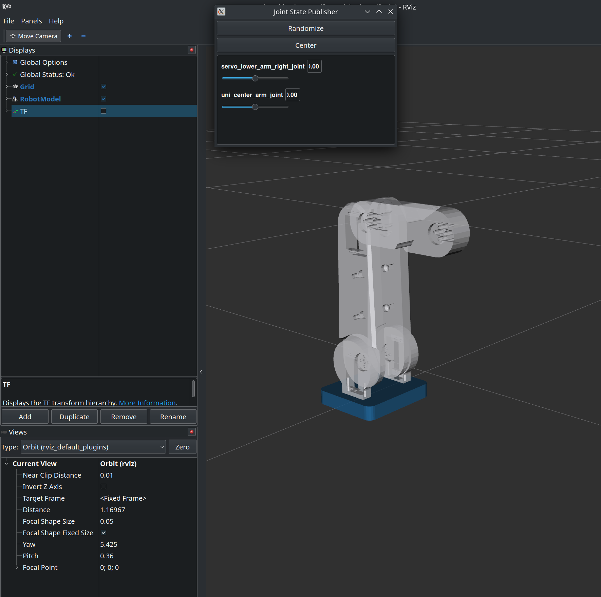

# ARM_m3
A robotics package for a custom-made 6DOF arm. 

# Documentation

During our initial testing phase, we implemented a parallel manipulator design. While we successfully visualized the manipulator in RViz (shown in Figure 1), we encountered several technical challenges:

1. Transform (TF) Generation Issues:
   - Difficulties in maintaining proper coordinate frame transformations
   - Inconsistencies in joint transformations, particularly at the parallel linkages

2. URDF Development Challenges:
   - Complex kinematic chain representation
   - Joint constraint specifications for parallel mechanisms
   - Issues with mimic joint configurations

*Figure 1: Parallel Manipulator Visualization in RViz*

Through this experience, we identified several areas for improvement. Our next phase of development will focus on:

1. Redesigning the system as a 2-link manipulator for:
   - Improved stability
   - Simplified kinematics
   - More reliable TF generation
   - Easier control implementation

2. Future Development Path:
   - Using the 2-link design as a foundation
   - Gradually extending to a custom 6-DOF articulated manipulator
   - Implementing robust control algorithms
   - Ensuring scalability of the design

This iterative approach will help us achieve a more robust and reliable manipulator system while maintaining full control over the design and implementation process.
